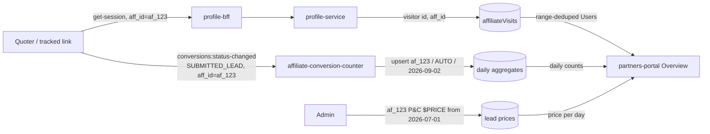

# Dashboard ERD

## Metadata

|  |  |
| --- | --- |
| **Status** | `Ready for review` |
| **Author** | @sijoon.lee |
| **Reviewers** | @Jacob Foster @Lee Robert @Abul Qasim @Artem Sheika |
| **Last updated** | 2026-09-02 |
| **Related** | [PRD](https://ratehub.atlassian.net/wiki/spaces/RET/pages/4503470081) · [SDD - Users](https://ratehub.atlassian.net/wiki/spaces/RET/pages/4507402261) · [SDD - Lead counting](https://ratehub.atlassian.net/wiki/spaces/RET/pages/4520673281) · [Design Decisions](../../example-output/design-decisions-v2.md) |

> This is `erd-revised-v2.md` with its rationale restated in the vocabulary of
> [Design Decisions](../../example-output/design-decisions-v2.md): decisions sorted by cost of
> being wrong, constraints filtered out before anything is traded, and every *because* written as
> **chose X for A, accepting B** using the fourteen named values. Nothing about the design changed.

The partners portal gets an Overview tab showing four numbers and one chart per vertical, and three of those four numbers exist nowhere in our systems today. The work is therefore three new data sources plus the views that join them: unique Users from a new `affiliateVisits` store, partner-attributed lead counts from a new consumer service, and admin-entered lead prices as effective-dated periods. Lead counting is the risky piece — it reads an at-least-once Kafka stream, so each daily aggregate must derive its count from stored conversion ids rather than a counter, and its day key must be the Toronto calendar day, because aggregation discards time-of-day and that boundary cannot be corrected at read time. Lead prices ship first, then the counter runs silently on dev writing aggregates nobody reads, then the tab itself. Users and Conversion Rate land last, so the tab can ship with two numbers and the chart while the Users source is still filling.

---

## Context

### Partners are paid per lead, and nothing counts leads per partner today

Partners embed our quoters and tracked links; we pay them per lead at a lead price ($/lead) set in each partner's contract, and those contracts live outside the partners-portal application. The [PRD](https://ratehub.atlassian.net/wiki/spaces/RET/pages/4503470081) owns the product case and the disclaimer that counts are unverified and revenue is a projection. Two names carry over from it: the PRD's "Unverified Leads" is the partner-facing name for `SUBMITTED_LEAD` **conversions**, and its "$/lead rate" is the **lead price**. UI copy keeps the PRD's names; the rest of this document uses the engineering ones.

## Goals & non-goals

### Counts come from the existing event stream, pre-aggregated per day

- Count partner-attributed leads per `aff_id`, per `productType`, per Toronto day from the platform's existing conversions stream — no new tracking in the quoter funnel.
- Answer every range query (30 days / 90 days / YTD / since beginning) from pre-aggregated daily records, with no scan over raw conversions at request time.
- Let Admins maintain each partner's lead price per vertical as effective-dated periods in the existing Admin page.
- Derive Projected Revenue, never store it: each day's count × the lead price in effect that day. A retroactive price correction therefore corrects displayed revenue.
- Gate the Mortgage vertical per partner, hidden by default, separate from the Milestone-1 access gates.

### Instants are UTC; the aggregate's day key is a plain Toronto date label

Every stored instant — a conversion's `created`, processing times, "data last refreshed" — is a UTC timestamp. The aggregate's day key is a plain `YYYY-MM-DD` label meaning the `America/Toronto` calendar day of the event's `content.created`, which travels in the payload and so is stable under replay. The label carries no timezone: the Toronto boundary is baked in at write time.

### This work does not verify leads, pay anyone, or split P&C

- **No lead verification pipeline.** Manual review by BUD/PM/stakeholders stays outside this system; the dashboard shows unverified counts and "Projected" revenue that will not update after payout cleanup.
- **No payout or invoicing.** Lead prices feed a dashboard projection; payment stays where it is today.
- **No sub-vertical breakdown.** Auto/home/condo are one P&C bucket for MVP. The aggregates keep `productType` in the key, so sub-tabs later need no reprocessing.

## Technical vision

### Three new sources write; the portal joins them at read time

The counter keeps events that pass a per-BU filter (Insurance keeps assigned, monetized `SUBMITTED_LEAD` events) and upserts one document per `(aff_id, productType, torontoDay)`. Each document stores the set of processed conversion ids and derives the day's count from that set's size, which is what makes replay and at-least-once redelivery harmless. Aggregates are keyed by `aff_id` because that is what the event carries; the portal resolves org → `aff_id` through the existing affiliates service at read time. [SDD - Lead counting](https://ratehub.atlassian.net/wiki/spaces/RET/pages/4520673281) holds the event type, the filter, the data model, and failure handling.

### Users is a range-level unique count, so it cannot be a daily counter

Users is the number of distinct visitor ids that arrived through a tracked link or the Quoter Launcher within the selected range; a different visitor id is a different user. Unique counts do not sum across days — the same person landing seven days running is one user, not seven — so the source deduplicates across the whole selected range. [SDD - Users](https://ratehub.atlassian.net/wiki/spaces/RET/pages/4507402261) holds the data source and the range-dedup mechanism.

### A lead price is a dated period, and periods may not overlap

A lead price is `{ partnerId, vertical, leadPrice, startDate, endDate?, createdBy, createdAt }`, dates inclusive and Toronto-dated, an empty `endDate` meaning "until further notice" and allowed only on the latest period. Overlapping periods within a vertical are refused. `createdBy`/`createdAt` make every price attributable, because the first disputed revenue number will be answered with "who set this, and when".

### The tab shows four numbers and one chart over one range

- **Users** — the range's deduplicated visitor count.
- **Unverified Leads** — the sum of the daily aggregates in the range.
- **Conversion Rate** — Unverified Leads ÷ Users over the same range, as a %. Zero Users shows no rate, not a division by zero.
- **Projected Revenue** — each day's count × that day's lead price, summed. A vertical with no lead price shows leads and an explanatory note, not a fabricated $0.
- **Chart** — Unverified Leads over time, one point per day, same range as the numbers.

## Design decisions

### What this feature only gets one attempt at

Sorted by what it costs to be wrong, not by how much argument each one attracted. Every decision below closes with an **If wrong** line carrying the same tier, so a reviewer with ten minutes can read the Tier 1 ones and skip the rest.

| Decision | Deletion test — if this is wrong, what do we touch? | Tier |
| --- | --- | --- |
| The aggregate's day key is a Toronto date label | A collection of daily documents whose time-of-day was discarded at write. Recoverable only by reprocessing the conversions stream, and only for as long as that stream is retained | **1** |
| Lead price is an effective-dated period | A financial record with attribution on every row. A single-price model cannot be un-flattened — the days a price applied to were never written down | **1** |
| Lead prices live in their own collection, not in `organization` | Rows plus one team boundary. Moving them later is a migration through an onboarding-owned document | **1** |
| Attribution reads `conversions:status-changed` | The counter, and the meaning of every aggregate written before we noticed. Attribution moving out of `track-conversion-from-inquiry` is a silent-wrong, not a broken-loud | **1** |
| Daily aggregates instead of aggregate-on-read | A consumer and a collection — both rebuildable from the stream, so this is a rewrite, not a data loss | 2 |
| Revenue computed at read time | Portal code only. No stored money anywhere | 2 |
| Which chart ships | A React component | 3 |
| Mortgage gating mechanism | A flag | 3 |

Two things follow. **The recorded/computed line is where the risk is.** Counts, revenue and the chart are all computed and therefore expendable — change the rule, recompute. The Toronto day key and the price periods are *recorded*, and a recorded thing that was never written cannot be recovered later: the same reason the no-backfill answer below is forced rather than chosen. **The Toronto day key is the one place this design converts a computed result into a permanent record**, because aggregation throws away the instant it was derived from. That is why it gets a decision of its own rather than a line in the SDD.

### Two arguments that were constraints, not trades

Filter these before comparing anything, or the comparison invents a trade-off that was never on the board.

| Looked like a choice | Who drew the line | Verdict |
| --- | --- | --- |
| "Should we source `aff_id` from profile events instead?" | The event schemas | **Threshold.** Profile events carry no `aff_id`, and no existing store is queryable by `aff_id`. Not a weaker option — not an option |
| "Chart conversion rate over time" | Arithmetic | **Threshold.** Daily unique users do not sum to range unique users, so daily rates do not compose into the range rate. A chart that cannot reconcile with the headline number is not a lower-Fidelity option, it is wrong |

The second one is worth stating loudly, because it disqualifies the option the 2026-08-25 PRD text asked for. The demonstration:

| Day | Visitors | Daily unique users |
| --- | --- | --- |
| Day 1 | A, B | 2 |
| Day 2 | A | 1 |
| Range | A, B | 2, not 3 |

Daily uniques sum to 3 while the range's Users is 2. Every option that charts a rate per day carries that defect, including the "ship both" option, so the filter removes two of the four candidates before any value is weighed.

### The settled four

Uncontested, but written in halves anyway — the cost of the sentence is eight words, and it is the record of what was traded.

**Lead counts come from `conversions:status-changed`**
- **For Fidelity** — this is the one place `aff_id` and `productType` already meet in the payload, so the count means "leads attributed to this partner" rather than "whatever we could join after the fact".
- **And Convergence** — the standard `@ratehub/sdk` consumer, the shape every other consumer in the platform already has.
- **Accepting Isolation** — the correctness of every number on this dashboard now depends on `track-conversion-from-inquiry` staying the attribution point, and that is another team's code with no contract saying so.
- **And Enforceability** — the `affiliate` field is free-form, so nothing but defensive parsing stands between a malformed value and a silently missing partner's leads.
- **If wrong** — Tier 1. Not because the consumer is expensive to rewrite, but because attribution drifting produces aggregates that look fine and are wrong, for as long as nobody checks.

**Lead price is an effective-dated period, not one editable number**
- **For Fidelity** — a contracted price genuinely has a start and an end in the world, and the revenue over a range is computable only if we know the price on each day.
- **And Re-derivability** — a single mutable field silently recomputes all past revenue at today's price, which is exactly the trap of storing a computed answer and discarding its input.
- **Accepting Economy** — a heavier admin UI, already built; settled in PRD review.
- **If wrong** — Tier 1, and the only one on this list that cannot be repaired at all. A single-price model is not a smaller version of this one: the days each price applied to were never written down, so there is nothing to migrate from. Getting the period shape wrong in the *other* direction is cheap — periods collapse to one price, one price does not expand into periods.

**Lead prices live in a standalone collection, one document per period**
- **For Isolation** — financial history does not belong in the onboarding-owned `organization` document, which would slowly become a changelog dragged along by every org fetch. This is a team boundary as much as a schema one.
- **And Legibility** — per-period attribution is a plain field on a row, matching the shape of the feature store's partner rows.
- **Accepting Enforceability** — overlap refusal is now application logic rather than a single-document invariant, so the rule holds only as long as every writer remembers it.
- **And Economy** — one extra indexed query per dashboard render.
- **Note the direction**: this is the reversibility asymmetry running the right way. The invariant we gave up is enforceable in code today; the document boundary, once financial history is inside `organization`, is a migration through somebody else's data.
- **If wrong** — Tier 1, by ownership rather than by volume. The rows are few and the shape is simple, but the two candidate homes belong to two teams, so moving them later is a coordinated migration through an onboarding-owned document rather than a schema change we can make alone.

**Revenue is computed at read time, counts × price-per-day**
- **For Re-derivability** — fixing a mistyped price heals history rather than leaving a frozen wrong number in every past day.
- **And Isolation** — the aggregates stay money-free and vertical-agnostic, and the consumer never learns that admin data exists.
- **Accepting Economy** — the portal owns the revenue math plus a small join per view, bounded by design at ≤ 365 rows × a few periods. Bounded `n`, so optimising it would spend Economy for nothing.
- **If wrong** — Tier 2, and cheaply so: no money is stored anywhere, so backing this out is portal code and nothing else. The Tier 1 version of this decision is the one we did *not* make — stamping revenue onto each aggregate at write time would have frozen every typo into rows we would then have to correct by hand.

### Daily aggregates, and the day key that comes with them

| Option | Pros | Cons |
| --- | --- | --- |
| **A — consumer maintains daily aggregates _(chosen)_** | Range queries are trivial sums; dashboard latency is independent of traffic; YTD and monthly come free | A new long-running consumer to own; idempotency becomes ours |
| B — store raw events, aggregate per request | No aggregation logic; maximal flexibility | Every view scans a growing event set; retention question from day one |
| C / do nothing | — | The dashboard has no data |

- **Chose** daily aggregates keyed `(aff_id, productType, torontoDay)`, upserted with `$addToSet` over processed conversion ids.
- **For Headroom** — every read pattern is a period sum, so read cost stops tracking total conversion volume. Option B's `n` is *every conversion we have ever written*, which is the growth class where our own success is what breaks it.
- **Accepting Economy** — a new long-running consumer to own — **and Enforceability**, since at-least-once redelivery means idempotency is now ours to get right rather than the platform's.
- **Not accepting Re-derivability.** The cheap version of this optimisation stores `count` and destroys the ability to recompute it. Storing the *set of processed conversion ids* and deriving the count from its size costs a document that grows with a partner's daily leads, and buys back both idempotency and the ability to answer questions a bare number cannot. That is the extra we paid on purpose, and it is the line most likely to be undone by someone who reads the schema and not this paragraph.
- **We accept** an id set that stays tiny only while one partner × one product type × one day stays small — revisit at thousands of leads per partner per day.
- **If wrong** — Tier 2. Both the consumer and the collection rebuild from the stream, so this is a rewrite, not a migration.

The day key is a separate decision hiding in the same schema, and it is the Tier 1 one.

- **Chose** the `America/Toronto` calendar day of `content.created` as a plain `YYYY-MM-DD` label.
- **For Fidelity** — a UTC bucket misfiles roughly 8 pm–midnight Toronto traffic into the next day, and misaligns counts against the Toronto-dated price periods revenue is computed from. Partners read these numbers in Toronto business days; so do the contracts.
- **Accepting Legibility** — a date field that silently carries a timezone in its definition and not in its type is exactly the shape that produces the "stored a date instead of a timestamp" incident, so the label's meaning has to live in documentation and in reviewers' heads.
- **If wrong** — Tier 1, with one mitigation. Aggregation discards time-of-day, so nothing in the aggregate can repair the boundary. It is recoverable only by reprocessing `conversions:status-changed` through `replay-helper`, and only for as long as that stream is retained. Beyond retention, the answer is gone.

### The chart

| Option | Pros | Cons |
| --- | --- | --- |
| A — both, leads chart first, rate chart after Users | Mock's chart ships early | **Filtered** — the rate chart carries C's arithmetic defect |
| **B — leads-over-time chart, Conversion Rate as a number _(chosen)_** | Daily counts sum to the range total, so chart and headline reconcile; needs only the counter's aggregates, so it does not wait for Users | Matches the original mock, not the 2026-08-25 PRD text; the rate number still waits for Users |
| C — conversion-rate over time | Matches the 2026-08-25 PRD text | **Filtered** — daily rates do not compose into the range rate |
| D — no chart in MVP | PRD allows it | Bare tiles; both docs expected a chart |

- **Chose** a leads-over-time chart plus a range-level Conversion Rate number — agreed with PM 2026-09-02, superseding the 2026-08-25 decision.
- **For Legibility** — the range is the only level at which the rate is arithmetically correct, and a dashboard should not invite a comparison that cannot reconcile.
- **And Speed** — the chart needs only the counter's aggregates, so it ships without waiting for the Users source.
- **Accepting Fidelity against the PRD's intent** — after the filter, *nothing* on this dashboard shows conversion effectiveness over time, because no correct version of that chart exists at this grain. That is a scope answer, not a design one, and it belongs back with product rather than buried here.
- **If wrong** — Tier 3. A React component and a week. The deliberation above lives entirely in the filter; once C and A are out, B over D is a convention call, recorded because the PRD says otherwise and not because the choice was hard.

### Mortgage gating

- **Chose** the existing per-partner feature-flag system over a dedicated flag.
- **For Convergence** — one mechanism for "is this partner allowed to see this", not two.
- **Accepting** nothing worth naming.
- **If wrong** — Tier 3. A flag, and an afternoon. Recorded only because a reviewer asked.

## Milestone list

1. **Lead prices are real** — admin UI persists lead-price periods; entered prices survive reload and are visible to both admins on dev.
2. **Leads are counted** — `affiliate-conversion-counter` runs on dev and produces a daily aggregate for a test `aff_id` after a quote submission on dev.
3. **Overview tab, leads and revenue** — P&C and Life show Unverified Leads, Projected Revenue and the leads-over-time chart from real aggregates and prices, with disclaimer copy and the no-price fallback; Mortgage hidden.
4. **Range filter + refreshed-at** — 30/90/YTD/since-beginning filters and the "data last refreshed" timestamp.
5. **Users + Conversion Rate** — once the Users source has collected and been sanity-checked, both numbers appear; until then the tab shows two numbers and the chart.

The order buys **Reversibility**, and it is bought rather than merely observed: shipping the consumer into dev to write aggregates nobody reads is work whose only product is finding out whether the numbers are right while being wrong is still free. It costs Speed — the tab lands a milestone later than it could — and the soak is thrown away afterwards.

## Test plan

### Testing targets arithmetic and redelivery, co-owned with QA

The two Tier 1 exposures above are exactly what the tests point at: the day boundary that cannot be corrected at read time, and the idempotency we accepted ownership of.

- **Unit** — lead-price period logic (overlap refusal, open ends, Toronto day boundaries including DST), revenue math (counts × dated prices, a price change mid-range), event parsing (missing or malformed `aff_id`, unknown `productType`).
- **Integration** — consumer idempotency: the same conversion delivered twice yields one count, and a replay over processed events changes nothing.
- **E2E/manual** — submit a quote on deployed dev with a test partner's `aff_id` and watch it reach that partner's dashboard. Local onboarding cannot complete by design, so this is dev-environment work.

## Deployment plan

### The consumer bakes silently before any UI exists

The consumer ships first and writes aggregates nobody reads, so it carries zero user impact and its numbers can be checked against known dev traffic before the tab exists. The Overview tab then ships behind the portal's existing per-partner feature gating if a gradual rollout is wanted; the tab is read-only, so rollback is un-deploying the UI with no data implications.

One caveat in the vocabulary's terms: **rollback undoes the deploy, not the rows.** Un-deploying the tab is genuinely free. Un-deploying the consumer leaves behind every aggregate it wrote, keyed by a day label it computed — so the reversibility claim covers the UI and stops at the collection.

## Open questions

| Question | Assignee | Answer |
| --- | --- | --- |
| Should we backfill numbers for existing partners? | Sijoon/Artem | **No backfill — and this is a constraint, not a trade.** Users cannot be backfilled: nothing recorded visits before collection starts, and a fact you did not write in March is not available in June. Backfilling only Leads would then divide a full lead count by a partial Users count, inflating Conversion Rate for every range reaching back before collection start — a **Fidelity** failure, not a cosmetic one. All numbers begin at collection start, so "since beginning" means "since collection began". **Accepting Legibility**: the dashboard copy now has to say so, because the label lies otherwise. |
| Mortgage per-partner visibility — existing feature-gate machinery or a dedicated flag? | Sijoon | Re-use the flag system. Convergence; Tier 3. |
| Final disclaimer copy per tab (we have it for P&C only) | Artem |  |

## Appendix

Confluence renders the diagram above only through the Mermaid macro or an exported image.

- Conversion event schema: `services/membership/track-conversion-from-inquiry/src/schema/zod_conversion_schema.ts`
- Attribution (`aff_id` attachment): `services/plat/profile/src/common/enrichRequestMetadata.js`
- Affiliates service: `services/membership/affiliates` (org ↔ affiliate id)
- Event replay tooling: `services/plat/replay-helper`

### Values used in this document

Drawn from the fourteen in [Design Decisions](../../example-output/design-decisions-v2.md) §3; listed so a reader can check that nothing here was improvised.

Fidelity · Re-derivability · Headroom · Enforceability · Isolation · Reversibility · Legibility · Convergence · Economy · Speed

Not used, and worth noticing: **Optionality** appears nowhere — every schema here is narrow on purpose. **Data Minimization** appears nowhere either, and the design stores a set of conversion ids per partner per day; if a retention rule covers those ids, that is a threshold this document has not checked.
