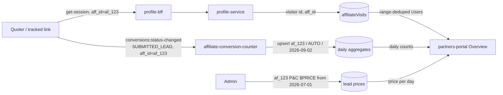

# Dashboard ERD

## Metadata

|  |  |
| --- | --- |
| **Status** | `Ready for review` |
| **Author** | @sijoon.lee |
| **Reviewers** | @Jacob Foster @Lee Robert @Abul Qasim @Artem Sheika |
| **Last updated** | 2026-09-02 |
| **Related** | [PRD](https://ratehub.atlassian.net/wiki/spaces/RET/pages/4503470081) · [SDD - Users](https://ratehub.atlassian.net/wiki/spaces/RET/pages/4507402261) · [SDD - Lead counting](https://ratehub.atlassian.net/wiki/spaces/RET/pages/4520673281) |

The partners portal gets an Overview tab showing four numbers and one chart per vertical, and three of those four numbers exist nowhere in our systems today. The work is therefore three new data sources plus the views that join them: unique Users from a new `affiliateVisits` store, partner-attributed lead counts from a new consumer service, and admin-entered lead prices as effective-dated periods. Lead counting is the risky piece — it reads an at-least-once Kafka stream, so each daily aggregate must derive its count from stored conversion ids rather than a counter, and its day key must be the Toronto calendar day, because aggregation discards time-of-day and that boundary cannot be corrected at read time. Lead prices ship first, then the counter runs silently on dev writing aggregates nobody reads, then the tab itself. Users and Conversion Rate land last, so the tab can ship with two numbers and the chart while the Users source is still filling.

---

## Context

### Partners are paid per lead, and nothing counts leads per partner today

Partners embed our quoters and tracked links; we pay them per lead at a lead price ($/lead) set in each partner's contract, and those contracts live outside the partners-portal application. The [PRD](https://ratehub.atlassian.net/wiki/spaces/RET/pages/4503470081) owns the product case and the disclaimer that counts are unverified and revenue is a projection. Two names carry over from it: the PRD's "Unverified Leads" is the partner-facing name for `SUBMITTED_LEAD` **conversions**, and its "$/lead rate" is the **lead price**. UI copy keeps the PRD's names; the rest of this document uses the engineering ones.

## Goals & non-goals

### Counts come from the existing event stream, pre-aggregated per day

- Count partner-attributed leads per `aff_id`, per `productType`, per Toronto day from the platform's existing conversions stream — no new tracking in the quoter funnel.
- Answer every range query (30 days / 90 days / YTD / since beginning) from pre-aggregated daily records, with no scan over raw conversions at request time.
- Let Admins maintain each partner's lead price per vertical as effective-dated periods in the existing Admin page.
- Derive Projected Revenue, never store it: each day's count × the lead price in effect that day. A retroactive price correction therefore corrects displayed revenue.
- Gate the Mortgage vertical per partner, hidden by default, separate from the Milestone-1 access gates.

### Instants are UTC; the aggregate's day key is a plain Toronto date label

Every stored instant — a conversion's `created`, processing times, "data last refreshed" — is a UTC timestamp. The aggregate's day key is a plain `YYYY-MM-DD` label meaning the `America/Toronto` calendar day of the event's `content.created`, which travels in the payload and so is stable under replay. The label carries no timezone: the Toronto boundary is baked in at write time.

### This work does not verify leads, pay anyone, or split P&C

- **No lead verification pipeline.** Manual review by BUD/PM/stakeholders stays outside this system; the dashboard shows unverified counts and "Projected" revenue that will not update after payout cleanup.
- **No payout or invoicing.** Lead prices feed a dashboard projection; payment stays where it is today.
- **No sub-vertical breakdown.** Auto/home/condo are one P&C bucket for MVP. The aggregates keep `productType` in the key, so sub-tabs later need no reprocessing.

## Technical vision

### Three new sources write; the portal joins them at read time

The counter keeps events that pass a per-BU filter (Insurance keeps assigned, monetized `SUBMITTED_LEAD` events) and upserts one document per `(aff_id, productType, torontoDay)`. Each document stores the set of processed conversion ids and derives the day's count from that set's size, which is what makes replay and at-least-once redelivery harmless. Aggregates are keyed by `aff_id` because that is what the event carries; the portal resolves org → `aff_id` through the existing affiliates service at read time. [SDD - Lead counting](https://ratehub.atlassian.net/wiki/spaces/RET/pages/4520673281) holds the event type, the filter, the data model, and failure handling.

### Users is a range-level unique count, so it cannot be a daily counter

Users is the number of distinct visitor ids that arrived through a tracked link or the Quoter Launcher within the selected range; a different visitor id is a different user. Unique counts do not sum across days — the same person landing seven days running is one user, not seven — so the source deduplicates across the whole selected range. [SDD - Users](https://ratehub.atlassian.net/wiki/spaces/RET/pages/4507402261) holds the data source and the range-dedup mechanism.

### A lead price is a dated period, and periods may not overlap

A lead price is `{ partnerId, vertical, leadPrice, startDate, endDate?, createdBy, createdAt }`, dates inclusive and Toronto-dated, an empty `endDate` meaning "until further notice" and allowed only on the latest period. Overlapping periods within a vertical are refused. `createdBy`/`createdAt` make every price attributable, because the first disputed revenue number will be answered with "who set this, and when".

### The tab shows four numbers and one chart over one range

- **Users** — the range's deduplicated visitor count.
- **Unverified Leads** — the sum of the daily aggregates in the range.
- **Conversion Rate** — Unverified Leads ÷ Users over the same range, as a %. Zero Users shows no rate, not a division by zero.
- **Projected Revenue** — each day's count × that day's lead price, summed. A vertical with no lead price shows leads and an explanatory note, not a fabricated $0.
- **Chart** — Unverified Leads over time, one point per day, same range as the numbers.

## Design decisions

### Four choices are settled and uncontested

| Decision | Chose | Because | We accept |
| --- | --- | --- | --- |
| Source of lead counts | Consume `conversions:status-changed` | The one place `aff_id` and `productType` already meet in-payload, on the standard `@ratehub/sdk` consumer; profile events carry no `aff_id`, and no existing store is queryable by `aff_id` | Defensive parsing of a free-form `affiliate` field, and a dependency on `track-conversion-from-inquiry` staying the attribution point |
| Lead-price shape | Effective-dated periods, not one editable price | Revenue over a range is computable only if we know the price on each day; a single field silently recomputes past revenue at today's price | A heavier admin UI, which is already built (settled in PRD review) |
| Lead-price storage | Standalone collection, one document per period | Financial history does not belong in the onboarding-owned `organization` document, which would slowly become a changelog dragged along by every org fetch; per-period attribution is a plain field, matching the feature-store's partner rows | Overlap refusal without single-document atomicity, and one extra indexed query per dashboard render |
| Revenue computation | At read time, counts × price-per-day | Fixing a mistyped price heals history, and the aggregates stay money-free and vertical-agnostic; a write-time stamp would freeze typos and couple the consumer to admin data | The portal owns the revenue math and a tiny join (≤ 365 rows × a few periods) per view |

### Daily aggregates beat aggregate-on-read, and the day key is Toronto's

| Option | Pros | Cons |
| --- | --- | --- |
| **A — consumer maintains daily aggregates _(chosen)_** | Range queries are trivial sums; dashboard latency is independent of traffic; YTD and monthly come free | A new long-running consumer to own; idempotency becomes ours |
| B — store raw events, aggregate per request | No aggregation logic; maximal flexibility | Every view scans a growing event set; retention question from day one |
| C / do nothing | — | The dashboard has no data |

- **Chose:** daily aggregates keyed `(aff_id, productType, torontoDay)`, upserted with `$addToSet` over processed conversion ids so one document's atomicity carries idempotency.
- **Because:** every read pattern is a period sum, so paying aggregation cost once at write is strictly better. A UTC day bucket would misfile roughly 8 pm–midnight Toronto traffic into the next day and misalign counts against the Toronto-dated price periods revenue is computed from.
- **We accept:** owning idempotency, and an id set per document that stays tiny only while one partner × one product type × one day stays small — revisit at thousands of leads per partner per day.

### The chart shows leads over time; Conversion Rate stays a number

| Option | Pros | Cons |
| --- | --- | --- |
| A — both, leads chart first, rate chart after Users | Mock's chart ships early | Two deliveries, and the rate chart carries C's defect |
| **B — leads-over-time chart, Conversion Rate as a number _(chosen)_** | Daily counts sum to the range total, so chart and headline number reconcile; needs only the counter's aggregates, so it does not wait for Users | Matches the original mock, not the 2026-08-25 PRD text; the rate number still waits for Users |
| C — conversion-rate over time | Matches the 2026-08-25 PRD text | Daily rates do not compose into the range rate; also blocked on Users |
| D — no chart in MVP | PRD allows it | Bare tiles; both docs expected a chart |

| Day | Visitors | Daily unique users |
| --- | --- | --- |
| Day 1 | A, B | 2 |
| Day 2 | A | 1 |
| Range | A, B | 2, not 3 |

Daily uniques sum to 3 while the range's Users is 2, so a rate chart is exact per point and wrong the moment a partner totals it against the headline numbers. Daily lead counts have no such trap.

- **Chose:** leads-over-time chart plus a range-level Conversion Rate number — agreed with PM 2026-09-02, superseding the 2026-08-25 decision.
- **Because:** the range is the only level at which the rate is arithmetically correct, and a dashboard should not invite a comparison that cannot reconcile.
- **We accept:** the chart no longer shows conversion effectiveness directly, and the rate number is the one tile that waits for the Users source.

## Milestone list

1. **Lead prices are real** — admin UI persists lead-price periods; entered prices survive reload and are visible to both admins on dev.
2. **Leads are counted** — `affiliate-conversion-counter` runs on dev and produces a daily aggregate for a test `aff_id` after a quote submission on dev.
3. **Overview tab, leads and revenue** — P&C and Life show Unverified Leads, Projected Revenue and the leads-over-time chart from real aggregates and prices, with disclaimer copy and the no-price fallback; Mortgage hidden.
4. **Range filter + refreshed-at** — 30/90/YTD/since-beginning filters and the "data last refreshed" timestamp.
5. **Users + Conversion Rate** — once the Users source has collected and been sanity-checked, both numbers appear; until then the tab shows two numbers and the chart.

## Test plan

### Testing targets arithmetic and redelivery, co-owned with QA

- **Unit** — lead-price period logic (overlap refusal, open ends, Toronto day boundaries including DST), revenue math (counts × dated prices, a price change mid-range), event parsing (missing or malformed `aff_id`, unknown `productType`).
- **Integration** — consumer idempotency: the same conversion delivered twice yields one count, and a replay over processed events changes nothing.
- **E2E/manual** — submit a quote on deployed dev with a test partner's `aff_id` and watch it reach that partner's dashboard. Local onboarding cannot complete by design, so this is dev-environment work.

## Deployment plan

### The consumer bakes silently before any UI exists

The consumer ships first and writes aggregates nobody reads, so it carries zero user impact and its numbers can be checked against known dev traffic before the tab exists. The Overview tab then ships behind the portal's existing per-partner feature gating if a gradual rollout is wanted; the tab is read-only, so rollback is un-deploying the UI with no data implications.

## Open questions

| Question | Assignee | Answer |
| --- | --- | --- |
| Should we backfill numbers for existing partners? | Sijoon/Artem | **No backfill.** Users cannot be backfilled — nothing recorded visits before collection starts — and backfilling only Leads would divide a full lead count by a partial Users count, inflating Conversion Rate for every range reaching back before collection start. All numbers begin at collection start, so "since beginning" means "since collection began" and the dashboard copy must say so. |
| Mortgage per-partner visibility — existing feature-gate machinery or a dedicated flag? | Sijoon | Re-use the flag system. |
| Final disclaimer copy per tab (we have it for P&C only) | Artem |  |

## Appendix

Confluence renders the diagram above only through the Mermaid macro or an exported image.

- Conversion event schema: `services/membership/track-conversion-from-inquiry/src/schema/zod_conversion_schema.ts`
- Attribution (`aff_id` attachment): `services/plat/profile/src/common/enrichRequestMetadata.js`
- Affiliates service: `services/membership/affiliates` (org ↔ affiliate id)
- Event replay tooling: `services/plat/replay-helper`
