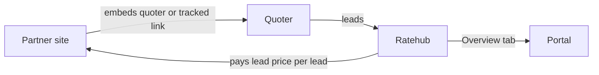
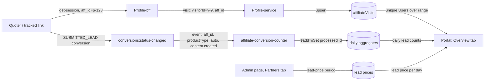
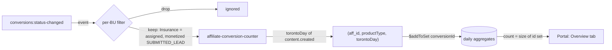
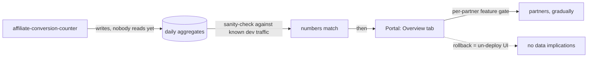

# Dashboard ERD

## Metadata

|  |  |
| --- | --- |
| **Status** | `Ready for review` |
| **Author** | @sijoon.lee |
| **Reviewers** | @Jacob Foster @Lee Robert @Abul Qasim @Artem Sheika |
| **Last updated** | 2026-09-02 |
| **Related** | [PRD](https://ratehub.atlassian.net/wiki/spaces/RET/pages/4503470081) · [SDD - Users](https://ratehub.atlassian.net/wiki/spaces/RET/pages/4507402261) · [SDD - Lead counting](https://ratehub.atlassian.net/wiki/spaces/RET/pages/4520673281) |

---

## TL;DR

- **What we build:** an Overview tab in the partners portal that shows, per vertical (P&C and Life for MVP), four numbers — Users, Unverified Leads, Conversion Rate, Projected Revenue — and one chart, Unverified Leads over time.
- **Pieces:** a Users source (Profile-service, `affiliateVisits`), a lead-price admin UI backed by a new collection, a new consumer `affiliate-conversion-counter` that keeps daily lead aggregates, and the portal read path that joins the three.
- **Risky decision:** the consumer buckets leads by Toronto calendar day and stays idempotent by storing processed conversion ids inside each daily document; a UTC bucket or a bare counter would be wrong in ways nobody can fix at read time.
- **Ships first:** the lead-price admin UI, then the consumer running silently on dev; the tab follows with leads, revenue, and the chart. Users and Conversion Rate land last, once the Users source has collected data.
- **Still open:** final disclaimer copy per tab (only P&C has it). Backfill (no) and Mortgage visibility (reuse the flag system) are answered.

## Context

### Terms

Each term is defined once here; the rest of the document uses the engineering name.

| Partner-facing name (PRD, UI copy) | Engineering name | Meaning |
| --- | --- | --- |
| Unverified Leads | **leads** | Partner-attributed `SUBMITTED_LEAD` conversion events, counted per `aff_id`, per `productType`, per Toronto day. Unverified: nobody has reviewed them. |
| $/lead rate | **lead price** | Dollars we pay a partner per lead, set in the partner's contract, per vertical, for a dated period. |
| Users | **Users** | Unique visitor ids that arrived via the partner's tracked link (`aff_id`) or the Quoter Launcher, within the selected range. |
| Conversion Rate | **Conversion Rate** | leads ÷ Users × 100, both over the same range. |
| Projected Revenue | **Projected Revenue** | Sum over each day in the range of (that day's leads × the lead price in effect that day). A projection, not a payout. |
| Vertical (P&C, Life, Mortgage) | **vertical** / `productType` | A vertical is the tab; `productType` is the finer event field (auto, home, condo roll up to P&C). |
| — | **Toronto day** | A `YYYY-MM-DD` label: the `America/Toronto` calendar day of an event's `content.created`. Not a timezone-bearing value. |
| — | **Portal** | Partners-portal, the app that renders the Overview tab and the Admin page. |

### Partners are paid per lead, and the PRD asks for an Overview tab that shows it



Partners embed our quoters and tracked links; we pay them per lead at the lead price set in each partner's contract. The [PRD](https://ratehub.atlassian.net/wiki/spaces/RET/pages/4503470081) calls for an Overview tab in the Portal.

| PRD requirement | Detail |
| --- | --- |
| Scope | Numbers per vertical; P&C and Life for MVP |
| Four numbers | Users, Unverified Leads, Conversion Rate, Projected Revenue |
| One chart | Unverified Leads over time |
| Copy | States that lead counts are unverified and revenue is a projection |

### The work has four pieces that meet in the dashboard

| Piece | Action items | Detail |
| --- | --- | --- |
| 1. Unique counts of Users get into the system | Profile-bff sends data to Profile-service on get-session; Profile-service stores it in `affiliateVisits`; Profile-service exposes new endpoints for Profile-bff and the Portal | [SDD - Users](https://ratehub.atlassian.net/wiki/spaces/RET/pages/4507402261) |
| 2. Contracted lead prices get into the system | Add a new Admin page menu where an Admin enters lead prices | Contracts live outside the Portal, so a human enters the price |
| 3. Leads are counted continuously | Set up the new aggregation service `affiliate-conversion-counter` | [SDD - Lead counting](https://ratehub.atlassian.net/wiki/spaces/RET/pages/4520673281) |
| 4. The dashboard joins the three | Read external data: [1] leads, [2] Users. Compute Conversion Rate = [1] ÷ [2] × 100 (%) and Projected Revenue = Σ over days of ([1] that day × lead price that day) | Read path lives in the Portal |

---

## Goals & non-goals

### Goals: count leads from the existing stream, answer ranges from daily records, price leads by dated periods

| # | Goal | Measurable outcome |
| --- | --- | --- |
| G1 | Count leads per `aff_id`, per vertical, per day from the platform's existing event stream | No new tracking added to the quoter funnel for lead counting |
| G2 | Date-range queries (30 days / 90 days / YTD / since beginning) answer from pre-aggregated daily records | No scan over raw conversion events at request time |
| G3 | Admins enter and maintain each partner's lead price per vertical as effective-dated periods, in the existing Admin page | Prices survive reload, visible to all admins |
| G4 | Projected Revenue is derived, never stored: daily lead counts × the lead price in effect that day | Correcting a lead price retroactively corrects the displayed revenue |
| G5 | One timezone rule across the consumer, the lead-price records, and the display | Instants are UTC timestamps; the aggregate's day key is a Toronto day label (details below) |

Per-partner visibility control for the Mortgage vertical, default hidden, is also a goal. It is separate from the Milestone-1 access gates.

<details>
<summary>G5 in full: instants are UTC, the day key is a Toronto label baked in at write time</summary>

Every instant is stored as a UTC timestamp: the conversion's `created`, processing times, "data last refreshed".

The aggregate's day key is a plain `YYYY-MM-DD` label meaning the Toronto calendar day (`America/Toronto`) of the event's `content.created`. `content.created` is the conversion's creation instant; it travels in the event payload and is stable under event replay.

The label is not a timezone-bearing value. The Toronto boundary is baked in at write time, because aggregation discards time-of-day and the choice cannot be revisited at read time.

</details>

### Non-goals: no verification, no payout, no sub-verticals

| Non-goal | Why it is out |
| --- | --- |
| **No lead verification pipeline** | Manual review by BUD/PM/stakeholders happens outside this system. The dashboard knowingly shows unverified counts and "Projected" revenue that will not update after payout cleanup (PRD's pipeline constraint). |
| **No payout or invoicing** | Lead-price records feed a projection on a dashboard; actual payment stays wherever it is today. |
| **No sub-vertical breakdown** | Auto/home/condo are one P&C bucket for MVP. Sub-tabs can come later because the aggregates keep `productType` granularity (see [daily aggregates decision](#daily-aggregates-are-pre-computed-at-write-time-and-keyed-by-toronto-day)). |

---

## Technical vision

### Data flows from the quoter through three stores into the Overview tab



Example values on arrows (`p-123`, `v-9`, `auto`) are illustrative. Two write paths feed two stores continuously; one admin write path feeds the third; the Portal reads all three per view.

| Number | Formula | Source | Ships in |
| --- | --- | --- | --- |
| Users | count of distinct `visitorId` over the range | `affiliateVisits` via Profile-service | Milestone 5 |
| Unverified Leads | sum of daily aggregate counts in the range | daily aggregates | Milestone 3 |
| Conversion Rate | Unverified Leads ÷ Users × 100 (%), both over the range | both of the above | Milestone 5 |
| Projected Revenue | Σ over days of (day's count × lead price in effect that day) | daily aggregates + lead prices | Milestone 3 |

### Users are unique visitor ids deduplicated across the range, not summed by day

**Users cannot be a plain daily counter: unique counts do not sum across days, so the source must deduplicate across the selected range.**

| Day | Landings by visitor id | Daily uniques |
| --- | --- | --- |
| 1 | v-9 | 1 |
| 2 | v-9 | 1 |
| 3 to 7 | v-9 each day | 1 each |
| Range (7 days) | v-9 | **1**, not 7 (7 landings; landings are not the metric) |

Users are the unique people who arrived via the partner's tracked link (`aff_id`) or landed in our quoter through the Quoter Launcher, within the selected range. Uniqueness is assumed from the visitor id; a person using a different visitor id counts as a different user. The [SDD - Users](https://ratehub.atlassian.net/wiki/spaces/RET/pages/4507402261) covers the data source and the range-dedup mechanism.

### Leads are counted once per Toronto day by a new consumer, keyed by aff_id



`affiliate-conversion-counter` consumes the platform's existing conversions event stream, keeps the events that pass a per-BU filter, and upserts one daily aggregate document per `(aff_id, productType, torontoDay)`.

```text
dailyAggregate {
  aff_id:        string      // affiliate id carried by the event; not the partner org
  productType:   string      // finer than the vertical tab (auto, home, condo, life)
  torontoDay:    string      // YYYY-MM-DD, Toronto calendar day of content.created
  conversionIds: string[]    // processed conversion ids; $addToSet, single-document atomic
  count:                     // derived from conversionIds.length; never a bare counter
}
```

Consumption is idempotent because the count is derived from the stored id set; a bare counter cannot be idempotent under Kafka's at-least-once delivery or event replay. Aggregates are keyed by `aff_id` because that is what the event carries; the Portal resolves org → `aff_id` through the existing affiliates service at read time.

The [SDD - Lead counting](https://ratehub.atlassian.net/wiki/spaces/RET/pages/4520673281) covers which event type to consume, the filter mechanism, the data model, and failure handling.

### Lead prices are dated periods per partner and vertical, entered by admins

```text
leadPrice {
  partnerId:  string    // partner org
  vertical:   string    // P&C | Life | Mortgage
  leadPrice:  number    // dollars per lead
  startDate:  string    // YYYY-MM-DD, inclusive, Toronto time
  endDate?:   string    // YYYY-MM-DD, inclusive; absent = "until further notice"
  createdBy:  string    // who set this price
  createdAt:  string    // UTC timestamp of the change
}
```

One document per lead-price period, in a standalone collection (see [storage decision](#lead-prices-live-in-a-standalone-collection-not-in-the-organization-document)). `createdBy` / `createdAt` make every price attributable: this is money, and "who set this and when" will be asked the first time a Projected Revenue number is disputed.

| Rule | Detail |
| --- | --- |
| Period | `(partner, vertical, $/lead, start date, end date?)`, dates inclusive, Toronto time |
| Open end | An empty end date means "until further notice"; allowed only on the latest window in a vertical |
| Overlap | Forbidden within a vertical |
| Where managed | Admins manage rows in the Admin page's Partners tab; multiple rows per vertical, each a window |
| No price | The dashboard still shows Users and leads, but no Projected Revenue until an Admin provides a price |

### The Overview tab computes rate and revenue at read time from the three sources

```mermaid
sequenceDiagram
  participant Portal as Portal: Overview tab
  participant Affiliates as affiliates service
  participant ProfileService as Profile-service
  participant DailyAggregates as daily aggregates
  participant LeadPrices as lead prices
  Portal->>Affiliates: org -> aff_id (example: org-7 -> p-123)
  Portal->>ProfileService: unique Users, aff_id, range
  Portal->>DailyAggregates: daily counts, aff_id, productType in vertical, range
  Portal->>LeadPrices: periods, partnerId, vertical
  Portal->>Portal: leads = sum(daily); rate = leads / Users; revenue = sum(day count x price that day)
```

```text
+--------------------------------------------------------------+
| Overview   [P&C] [Life]            range: 30d 90d YTD all     |
| Unverified lead counts; revenue is a projection.             |
+-------------+---------------+--------------+-----------------+
| Users       | Unverified    | Conversion   | Projected       |
|             | Leads         | Rate         | Revenue         |
+-------------+---------------+--------------+-----------------+
| Unverified Leads over time (one point per Toronto day)       |
|  .  .   .    .  .   . .  .   .    .  .  .    .   .  .        |
+--------------------------------------------------------------+
| Data last refreshed: <UTC timestamp>                         |
+--------------------------------------------------------------+
```

| Tile | Rule when the input is missing |
| --- | --- |
| Conversion Rate | A range with zero Users shows no rate rather than a division by zero |
| Projected Revenue | A vertical with no lead price shows leads but no revenue figure, with an explanatory note, rather than a fabricated $0 |

The chart shows leads over time, one point per day, for the same range as the numbers. Daily lead counts sum to the range total, so the chart always reconciles with the Unverified Leads number above it; a conversion-rate chart cannot offer that (see [chart decision](#the-chart-shows-leads-over-time-conversion-rate-is-a-number)).

---

## Design decisions

### Lead counts come from the conversions:status-changed stream

| Option | Pros | Cons |
| --- | --- | --- |
| **A — consume `conversions:status-changed` _(chosen)_** | Carries `aff_id` and `productType` in-payload; standard `@ratehub/sdk` events consumer; no upstream changes | `affiliate` field is free-form — needs defensive parsing |
| B — consume `profiles` document events | Fires at document creation | No `aff_id` in payload; requires a profile fetch per event |
| C — query existing conversion stores at request time | No new consumer | No store is queryable by `aff_id`; couples the Portal to membership-team internals; slow, unbounded queries |

- **Chose:** consume the conversions stream.
- **Because:** it is the one place attribution and vertical already meet.
- **We accept:** parsing a loosely-typed field and depending on `track-conversion-from-inquiry` staying the attribution point.

<details>
<summary>Where attribution and the schema live</summary>

The conversion event schema and the attribution point are listed in the [Appendix](#appendix). The `affiliate` field's free-form shape is why the consumer's parsing of missing or malformed `aff_id` is a unit-test target in the [Test plan](#test-plan).

</details>

### Daily aggregates are pre-computed at write time and keyed by Toronto day

| Option | Pros | Cons |
| --- | --- | --- |
| **A — consumer maintains daily aggregates _(chosen)_** | Range queries are trivial sums; dashboard latency independent of traffic; YTD/monthly free (PRD note) | A new long-running consumer to own; needs idempotency |
| B — store raw events, aggregate per request | No aggregation logic; maximal flexibility | Every dashboard view scans a growing event set; retention question from day one |
| C / do nothing — no counting | — | The dashboard has no data |

- **Chose:** daily aggregates keyed `(aff_id, productType, torontoDay)`, upserted idempotently; `torontoDay` is a `YYYY-MM-DD` label while every stored instant stays a UTC timestamp.
- **Because:** the dashboard's read patterns are all period sums, so paying the aggregation cost once at write is strictly better.
- **We accept:** owning idempotency as the price of at-least-once delivery and replayability.

<details>
<summary>Why productType stays in the key</summary>

Keeping `productType` (not the collapsed P&C bucket) in the key costs a few rows per day and buys the future sub-vertical tabs without reprocessing.

</details>

<details>
<summary>Why processed ids live inside the daily document, not in a separate dedup collection</summary>

The consumer stores processed conversion ids in the daily document with `$addToSet`, which gives single-document atomicity, and derives the count from the set's size.

A separate dedup collection was rejected because two documents cannot be updated atomically without transactions. This key's cardinality (one partner × one product type × one day) keeps the id set tiny.

Revisit if a vertical ever produces thousands of leads per partner per day.

</details>

<details>
<summary>Why a Toronto day boundary, not a UTC day</summary>

The Toronto boundary is deliberate, not an oversight of "store UTC". A UTC-day bucket would misfile roughly 8 pm to midnight Toronto traffic into the next day. Illustrative rows:

| Event `content.created` (UTC) | Toronto local time | UTC day | Toronto day |
| --- | --- | --- | --- |
| 2026-06-10T23:30Z | 2026-06-10 19:30 | 06-10 | 06-10 |
| 2026-06-11T01:30Z | 2026-06-10 21:30 | **06-11** | 06-10 |
| 2026-06-11T03:59Z | 2026-06-10 23:59 | **06-11** | 06-10 |

A UTC key would also misalign counts against the Toronto-dated lead-price periods that revenue is computed from. Because aggregation discards time-of-day, the boundary could never be corrected at read time.

</details>

### Lead prices are effective-dated periods, not a single number

| Option | Pros | Cons |
| --- | --- | --- |
| **A — effective-dated periods per (partner, vertical) _(chosen)_** | History preserved; supports campaigns/promotions; retroactive corrections possible | More rows and UI than a single number |
| B — one editable price field per partner-vertical | Simplest | Price changes rewrite history; past revenue silently recomputed at today's lead price |

- **Chose:** dated periods.
- **Because:** revenue over a range is only computable if we know the lead price on each day of the range.
- **We accept:** the heavier admin UI, which is already built.

<details>
<summary>History: settled during PRD review</summary>

This was already settled during PRD review (PRD Personal notes) and is reflected in the built admin UX. Illustrative rows showing why a single field fails:

| Day | Leads | Price in effect | Revenue (dated periods) | Revenue (single field, price later edited to $12) |
| --- | --- | --- | --- | --- |
| 1 | 3 | $10 | $30 | $36 |
| 2 | 2 | $10 | $20 | $24 |
| 3 | 4 | $12 | $48 | $48 |
| Range | 9 | — | **$98** | $108, history rewritten |

</details>

### Lead prices live in a standalone collection, not in the organization document

| Option | Pros | Cons |
| --- | --- | --- |
| **A — standalone collection, one document per lead-price period _(chosen)_** | Clean write-path ownership (admin-only, separate from the onboarding-owned `organization` doc); per-period attribution (`createdBy`/`createdAt`) is just fields on the row, like the blocklist's `blockedBy`; matches the Portal's precedent for admin-managed per-partner config (the feature-store's partner rows); history accumulates in its own collection | Overlap refusal loses single-document atomicity — needs a careful upsert or transaction; one extra (indexed, tiny) query on dashboard render |
| B — embedded in the `organization` record (`LeadPrices` map) | Prices arrive free with the org fetch; overlap check is atomic within one document; no new collection | Two writers with different auth paths (onboarding flow and admin actions) share one document; per-entry attribution is awkward in nested arrays; as promotional periods accumulate over years, the org document slowly becomes a changelog that every org fetch (auth checks, admin lists) drags along |

- **Chose:** standalone collection.
- **Because:** financial history does not belong inside a shared identity document.
- **We accept:** implementing the overlap check without single-document atomicity, and one extra query per dashboard view.

<details>
<summary>Why the org document is the wrong home for money data</summary>

Embedded price periods would turn `organization` into a slowly growing changelog with mixed ownership (onboarding flow and admin actions). Money data needs the per-change attribution that a row-per-period shape gives naturally.

</details>

### Projected Revenue is computed at read time

| Option | Pros | Cons |
| --- | --- | --- |
| **A — at read time: counts × lead-price-per-day _(chosen)_** | Self-correcting — fixing a mistyped lead price heals history; aggregates stay money-free and vertical-agnostic | Portal does a small join (days × price periods) per view |
| B — at write time: consumer stamps each day's revenue | Reads are pure sums | Freezes typos into history; consumer must know lead prices, coupling it to the Portal's admin data |

- **Chose:** read time.
- **Because:** correctness under price corrections matters more than saving a tiny join (≤ 365 daily rows × a handful of price periods).
- **We accept:** that the Portal owns the revenue math.

<details>
<summary>How the join works</summary>

For each Toronto day in the range, the Portal finds the lead-price period whose inclusive `startDate`..`endDate` contains the day, multiplies the day's count by that price, and sums. Days with no matching period contribute no revenue and trigger the no-price note described in [Technical vision](#the-overview-tab-computes-rate-and-revenue-at-read-time-from-the-three-sources).

</details>

### The chart shows leads over time; Conversion Rate is a number

| Option | Pros | Cons |
| --- | --- | --- |
| A — both, sequenced: leads-over-time first, conversion-rate after Users | Mock's chart ships early with no new data source | Two chart deliveries; the conversion-rate chart has the reconciliation problem described under C |
| **B — leads-over-time chart, with Conversion Rate as a number _(chosen)_** | Daily counts sum to the range total, so the chart reconciles with the Unverified Leads number; needs only the counter's daily aggregates, so it ships with the numbers and does not wait for the Users source; the PRD's intent (conversion effectiveness) is kept as a range-level number, which is the only level at which the rate is correct | Matches the original mock rather than the 2026-08-25 PRD text; the Conversion Rate number still waits for the Users source |
| C — conversion-rate over time | Matches the 2026-08-25 PRD text | **Daily rates do not compose into the range rate.** Each point's denominator is that day's unique users, but the range's Users number is deduplicated across the whole range. A partner who reads the chart against the numbers above it sees figures that cannot be reconciled. Also blocked on the Users source, so the tab ships chartless until then |
| D — no chart in MVP | PRD allows it | Tab is bare tiles; both docs expected a chart |

- **Chose:** leads-over-time chart plus a Conversion Rate number — agreed with PM, 2026-09-02 (supersedes the 2026-08-25 decision for a conversion-rate-only chart).
- **Because:** daily lead counts sum to the range total; daily conversion rates do not compose into the range rate.
- **We accept:** that the chart no longer shows conversion effectiveness directly, and that the Conversion Rate number is the one thing on the tab that waits for the Users source.

<details>
<summary>Why daily conversion rates cannot be totalled</summary>

The sum of daily uniques is larger than the range's uniques whenever anyone returns on a later day.

| Day | Visitors | Daily uniques |
| --- | --- | --- |
| 1 | A, B | 2 |
| 2 | A | 1 |
| Range | A, B | **2**, not 3 |

A conversion-rate chart is correct per point but wrong the moment a reader totals it, and a dashboard that invites that comparison will confuse partners. Leads over time has no such trap.

Conversion Rate stays on the dashboard as a number computed over the selected range, where both numerator and denominator are range-level and the rate is exact.

</details>

---

## Milestone list

### Five milestones; lead prices first, the silent consumer second, Users and Conversion Rate last

| # | Milestone | Demoable / deployable result |
| --- | --- | --- |
| 1 | **Lead prices are real** | The lead-price admin UI persists prices; entered prices survive reload and are visible to both admins; demoable on dev |
| 2 | **Leads are counted** | `affiliate-conversion-counter` runs on dev, processes `conversions:status-changed`, and daily aggregate records can be shown for a test affiliate id after submitting a quote on dev |
| 3 | **Overview tab, leads and revenue** | P&C and Life tabs show Unverified Leads and Projected Revenue from real aggregates and lead prices, plus the leads-over-time chart from the same aggregates, with the disclaimer copy and the no-price fallback; Mortgage hidden by default |
| 4 | **Range filter + refreshed-at** | 30 / 90 / YTD / since-beginning filters and the "data last refreshed" timestamp |
| 5 | **Users + Conversion Rate** | Once the Users source has collected and been sanity-checked: the Users number and the Conversion Rate number (Unverified Leads ÷ Users over the selected range) |

Until Milestone 5 the Overview tab shows two numbers and the chart.

---

## Test plan

### Date boundaries, idempotency, and revenue math get automated tests; attribution is checked end to end on dev

**Co-owned with QA; this is the summary of intent.**

| Level | What is tested | Risk covered |
| --- | --- | --- |
| Unit | Lead-price-period logic: overlap refusal, open ends, Toronto day boundaries including the DST transitions | Wrong day bucket or a price gap misstates revenue |
| Unit | Revenue math: counts × dated prices, price changes mid-range | Wrong join between days and periods |
| Unit | Consumer event parsing: missing or malformed `aff_id`, unknown `productType` | Free-form `affiliate` field breaks counting |
| Integration | Consumer idempotency: the same conversion delivered twice yields one count; replay over processed events changes nothing | At-least-once delivery inflates counts |
| E2E / manual | Submit a quote on deployed dev with a test partner's `aff_id` and watch it land on that partner's dashboard | Attribution breaks somewhere between quoter and tab |

The E2E check is dev-environment work: local onboarding cannot complete by design.

---

## Deployment plan

### The consumer ships silently first; the tab ships behind the existing per-partner gate



| Step | Rule |
| --- | --- |
| Consumer first | Ships and runs silently, writing aggregates nobody reads yet; bakes with zero user impact while its numbers are checked against known dev traffic before any UI exists |
| Tab second | Ships behind the Portal's existing per-partner feature gating if a gradual rollout is wanted |
| Rollback | The tab is read-only, so rollback is un-deploying the UI, with no data implications |

---

## Open questions

### No backfill; Mortgage visibility reuses the flag system; disclaimer copy is still open

| Question | Assignee | Answer |
| --- | --- | --- |
| Should we backfill numbers for existing partners? | Sijoon/Artem | **No backfill.** All numbers begin at collection start (details below). |
| Mortgage per-partner visibility — reuse the existing feature-gate machinery or a dedicated flag? | Sijoon | Re-use the flag system. |
| Final disclaimer copy per tab (we only have it for P&C) | Artem |  |

<details>
<summary>Why neither Users nor leads are backfilled</summary>

Users cannot be backfilled: nothing recorded visits before collection starts. Leads could be replayed from the Kafka topic, but backfilling only leads would divide a full lead count by a partial Users count and inflate Conversion Rate for every range reaching before collection start.

| Range start | Leads | Users | Conversion Rate |
| --- | --- | --- | --- |
| After collection start | complete | complete | correct |
| Before collection start, leads backfilled | complete | partial | **inflated** |
| Before collection start, no backfill | from collection start | from collection start | correct for what is shown |

Consequence: "since beginning" reads as "since collection began" for partners who were already with us before this shipped, and the dashboard copy must say so.

</details>

---

## Appendix

| Pointer | Location |
| --- | --- |
| Conversion event schema | `services/membership/track-conversion-from-inquiry/src/schema/zod_conversion_schema.ts` |
| Attribution (`aff_id` attachment) | `services/plat/profile/src/common/enrichRequestMetadata.js` |
| Affiliates service (org ↔ affiliate id) | `services/membership/affiliates` |
| Event replay tooling | `services/plat/replay-helper` |
| PRD | [Confluence](https://ratehub.atlassian.net/wiki/spaces/RET/pages/4503470081) |
| SDD - Users | [Confluence](https://ratehub.atlassian.net/wiki/spaces/RET/pages/4507402261) |
| SDD - Lead counting | [Confluence](https://ratehub.atlassian.net/wiki/spaces/RET/pages/4520673281) |

Diagrams in this document are mermaid. On Confluence they need the Mermaid macro or an exported image.
